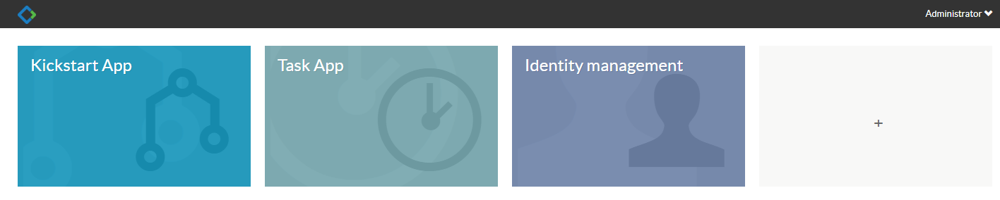

## 下载安装

官网地址 https://www.activiti.org
当前Released版是6.0，Beta版是7.0，源码在GitHub，先不要源码安装

https://www.activiti.org/get-started
https://github.com/Activiti/Activiti/releases/download/activiti-6.0.0/activiti-6.0.0.zip

## 目录结构
```
database
	create
	drop
	upgrade
libs
wars
	activiti-app.war
	activiti-admin.war
	activiti-rest.war
```
database下是数据库脚本，包括h2、mysql、oracle、postgres等各种数据库的
libs下是jar包和源码包
wars下是官方提供的war包，仍在Tomcat下就可以运行，默认使用的是h2内存数据库
	activiti-app.war:Activiti官方发布的activiti-app，可以说是一个较为完善的样例，用户可通过试用该应用来了解Activiti的大部分功能。随Activiti6.0版本发布的官方示例，包括流程图定义、流程发布、动态表单等一系列功能。
	activiti-admin.war:用于查看流程引擎的主要数据，包括流程引擎的部署信息、流程定义、任务等数据.

## 运行示例

先不管database和libs，将war包扔到Tomcat的webapps下，启动，访问http://localhost:8080/activiti-app

使用admin/test登录，登录后主页面


Kickstart App：主要用于流程模型管理、表单管理及应用（App）管理，一个应用可以包含多个流程模型，应用可发布给其他用户使用。
Task App：用于管理整个activiti-app的任务，在该功能里面也可以启动流程。
Idenity management：身份信息管理，可以管理用户、用户组等数据。


http://localhost:8080/activiti-admin
使用admin/admin登录


https://www.jianshu.com/p/701056e672a4  Activiti6简明教程
https://segmentfault.com/a/1190000010934777  activiti个人学习总结
https://segmentfault.com/a/1190000013839729  Activiti就是这么简单

http://lucaslz.com/2016/11/15/java/activiti/activiti-db-5-22/  Activiti 5.22 框架数据库设计说明


http://how2j.cn