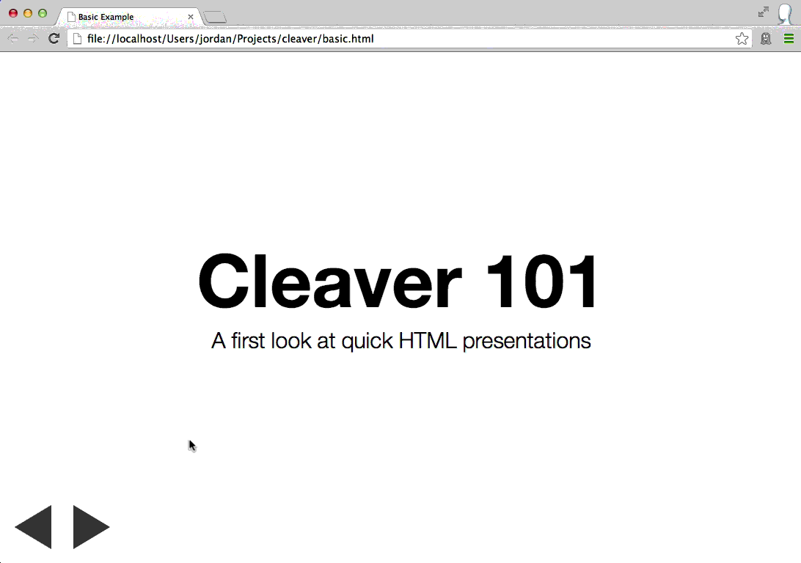

### Cleaver介绍

使用Cleaver基于Markdown文档30秒快速制作网页幻灯片，可以不用ppt了！
原理是将Markdown文档编译成Html文档，然后在浏览器中查看！

[Cleaver](https://github.com/jdan/cleaver)

[在线演示](http://jdan.github.io/cleaver/)

--

### Cleaver安装

打开Git Bash，切换到D盘
```
$ cd d:/
```
新建node工作空间node-workspace
```
$ mkdir node-workspace
$ cd node-workspace/
```
新建node项目TestCleaver
```
$ mkdir TestCleaver
$ cd TestCleaver/
$ npm init
```
安装cleaver，本地化安装是为了方便查看cleaver自带例子
```bash
npm install cleaver -g
npm install cleaver
```

--

### Cleaver使用

.md编译成.html，basic.md是Cleaver自带例子
```
$ cleaver node_modules/cleaver/examples/basic.md
```
发现项目目录生成basic.html，在浏览器中打开，炫酷幻灯片出现


--

### Cleaver配置项

```
title: Basic Example
author:
  name: Jordan Scales
  twitter: jdan
  url: http://jordanscales.com
output: basic.html
```
title是网页标题
author会在幻灯片最后一页显示
output生成html名称

更多参考[GitHub](https://github.com/jdan/cleaver)